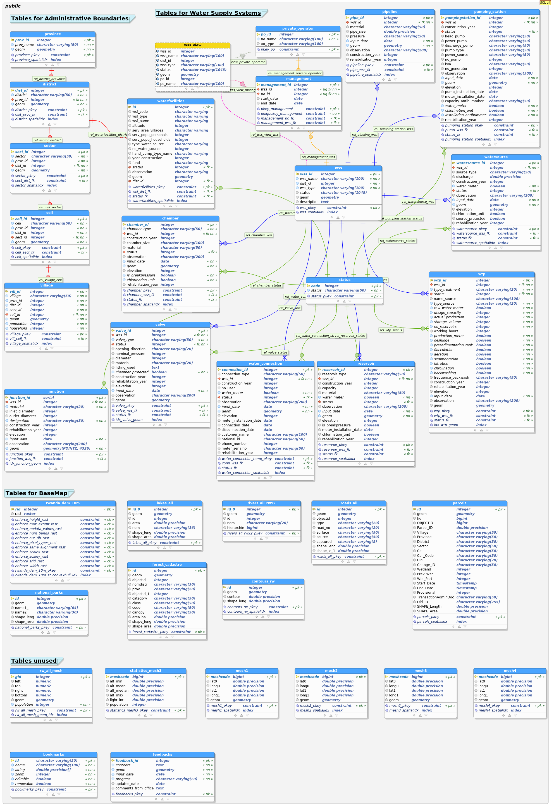

# PostGIS ER Diagram for GIS Database in RWSS, WASAC
This GIS database was designed for RWSS of WASAC through RWASOM project of JICA.

The following is the ER Diagram for rwss_assets database.

## Diagram


## How to modify

We are using pgmodeler to edit diagram. 
You can follow the below methods to install it according to operation system.
After installation, you can open `rwss_assets.dbm` to edit the diagram.

### for Windows users
Please follow this ]instruction](https://github.com/apazga/docker-pgmodeler) to install pgmodeler.

### for MacOS users
Please follow this [instruction](https://github.com/GrindrodBank/pgmodeler-x11) to launch pgmodeler.

Before launching it, you may need to install docker and xquartz by homebrew. You make sure reboot your mac after installing xquartz.
```
brew cask install docker
brew cask install xquartz
```

```
Copyright © 2020 WASAC Ltd.
```